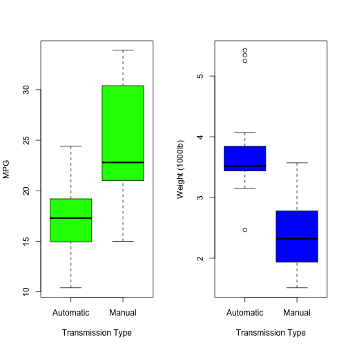
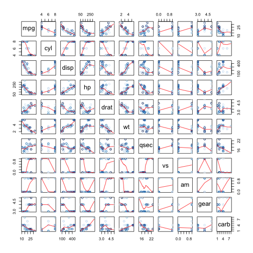

Developing Data Products: Analsysis of mtcars Dataset
========================================================
author: Amit Kohli
date: March 6, 2016
autosize: true

Executive Summary
========================================================

This report analyzes mtcars dataset to explore if an automatic or manual transmission is better for cars in terms of miles per gallon (MPG) and quantifying the difference between both types of transmissions. The reports uncovers a strong relationship between vehicle weight and transmission type, but there is still a statistically significant increase in the mean value of gas mileage attributable to manual transmissions – between 0.05 and 5.8 mpg.

By checking correlations, weight variable affects the fuel economy the most - and by plotting MPG and weight against transmission types (*Figures 1 & 2*) -- the report reveals that weight difference for transmissions is stronger than MPG difference. 


Exploratory Data Analysis: Dataset has 32 observations on 11 variables.
========================================================


```r
dim(mtcars)
```

```
[1] 32 11
```

```r
head(mtcars)
```

```
                   mpg cyl disp  hp drat    wt  qsec vs am gear carb
Mazda RX4         21.0   6  160 110 3.90 2.620 16.46  0  1    4    4
Mazda RX4 Wag     21.0   6  160 110 3.90 2.875 17.02  0  1    4    4
Datsun 710        22.8   4  108  93 3.85 2.320 18.61  1  1    4    1
Hornet 4 Drive    21.4   6  258 110 3.08 3.215 19.44  1  0    3    1
Hornet Sportabout 18.7   8  360 175 3.15 3.440 17.02  0  0    3    2
Valiant           18.1   6  225 105 2.76 3.460 20.22  1  0    3    1
```

Figure 1 - Boxplot of MPG vs. Transmission 
========================================================



Figure 2 - Pair Graph of Motor Trend Dataset 
========================================================


